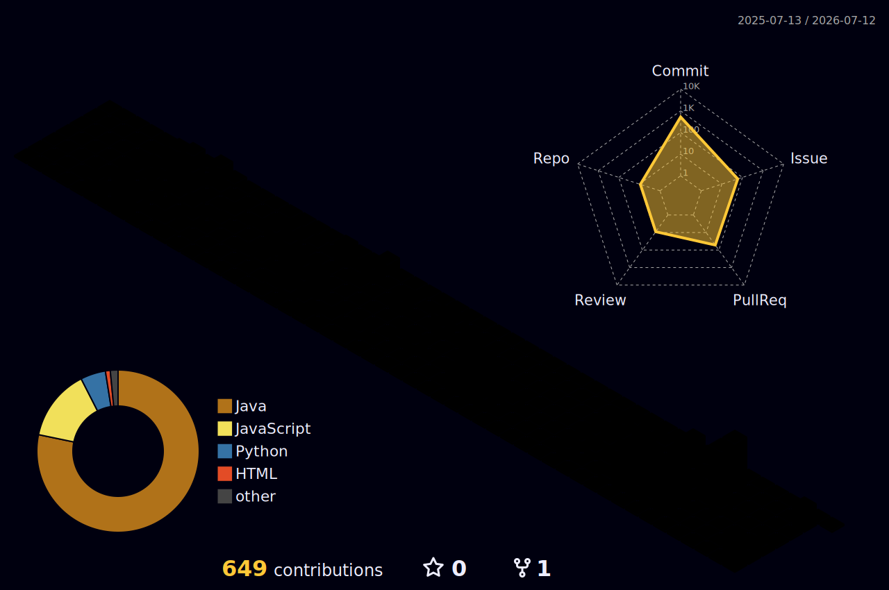

## 🔨 Once I've used 🔨
### Backend
 

### Frontend

### Database
 

### DevOps
 
 

### Others
 

## 💡 My Favorite 💡

  

## 📈 GitHub stats 📈

## 🏙️ My Contributions in 3D 🏙️

## ✉️ Contact me ✉️

   
